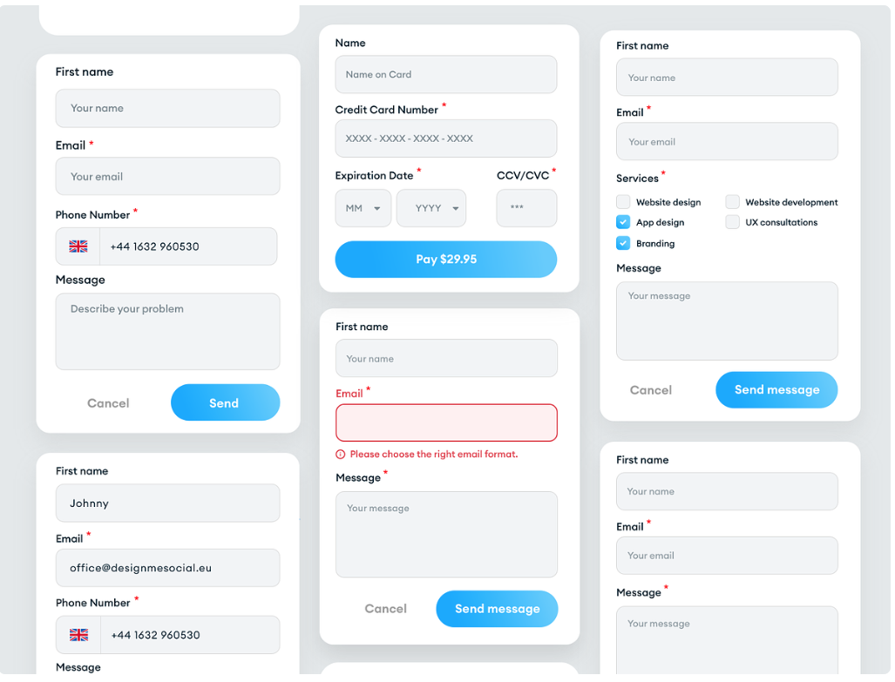
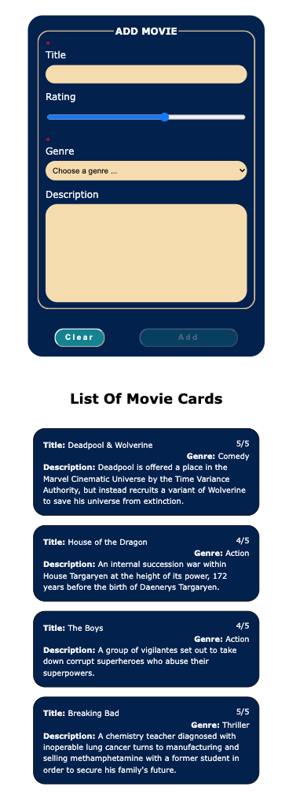
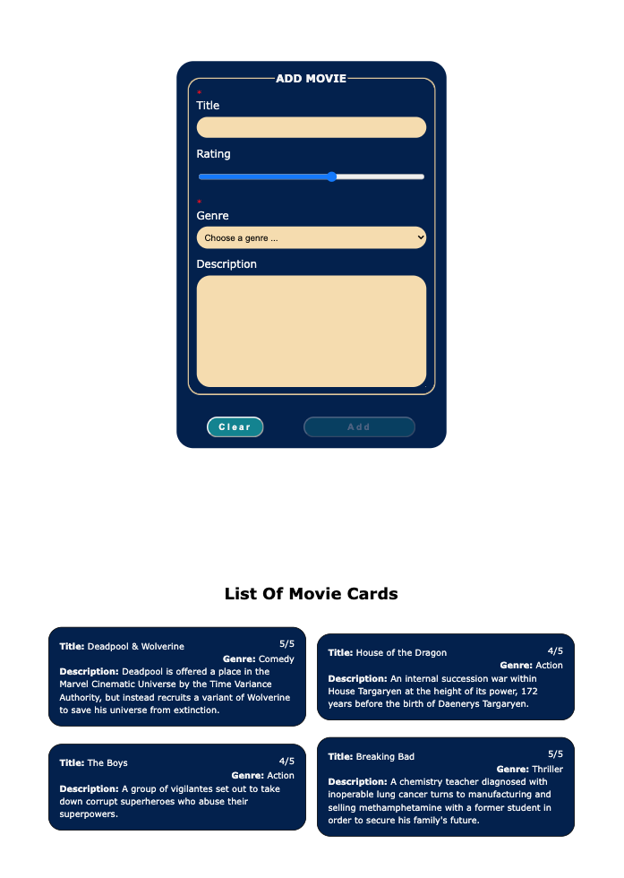
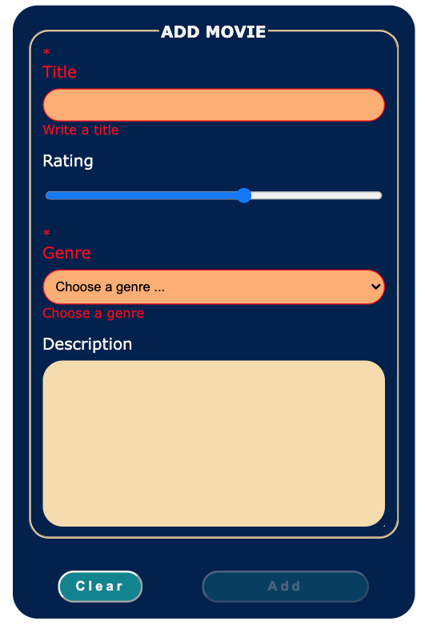

# My Solution
Inspiration

Small-screen

Medium-screen

Big-screen

Error & Disabled Button

# Movie Cards Exrecise

You are going to create a webpage where you can add movie cards. This will be done through a form, where the user can type in a title, rating, genre and a description.

The image at the bottom of this article is just a wireframe, your application should resemble that one but you should take it to the next level.

<figure style=" margin: 0; text-align: center">
  <figcaption>AddMovie</figcaption>
  
</figure>

### Requirements of the application

- **Title**, is an `<input>` field of the type text.
- **Rating**, is an `<input>` of the type range.
- **Genre**, is a `select` element with several `<option>` _( dropdown )_.
- **Description**, is a `<textarea>`.

### Instructions

**Before you start, you must run a `npm install` in this folder in order to install all the dependencies. Then you do a `npm run dev` in order to start the application. NO "Live Server" usage here as Vite will fire up a development server for you.**

- This exercise must be create with React Typescript and Vite. An application has been scaffolded for you.

1. Create a component for `<AddMovie>` with TSX that includes the input fields and buttons from the first image.

2. I `<AddMovie>`, connect the fields to variabels and do a `console.log()` on these when you click "Add".

3. Put all these variabels in an object and log it to the console.

4. Create a component, `<MovieCard>` that has TSX like the second image.

5. In `<MovieCard>`, add props and connect them to the different parts of the TSX.

6. Render one `<MovieCard>`, that takes one movie object from `<AddMovie>` as props, under the `<AddMovie>` component when you click "Add".

7. Add every movie object, that is created, to an array and render a `<MovieCard>` for every movie object with a map-function. Put them under the `<AddMovie>` component.

8. Create another component, `<MovieList>` that renders out a list of `<MovieCard>`. It should take a prop that contains the array of movie object. Use this component instead of the individual `<MovieCard>`.

9. When you click on a `<MovieCard>` it should be deleted from the array. React will handle the rerendering of the DOM.

  <figcaption>MovieCard</figcaption>
  

